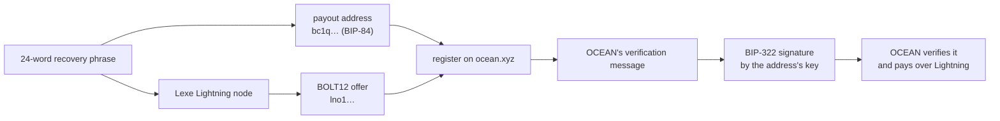

# Landfall

Get your OCEAN mining rewards over Lightning, into a wallet you own, from a
single recovery phrase.

## The story

OCEAN can pay mining rewards over Lightning instead of on-chain. To switch it
on, a miner hands OCEAN three things:

1. the **payout address** they mine to (a `bc1q…` Bitcoin address);
2. a **BOLT12 offer**, a reusable Lightning "address" (`lno1…`) where the
   rewards should land;
3. a **BIP-322 signature**: proof that whoever controls the payout address
   really asked for rewards to go to that offer.

Each piece is reasonable on its own. Together they ask a lot of a miner: run a
Lightning node, hold a Bitcoin key, use a message-signing standard most
wallets do not support, and copy long strings between three places. Get one
detail wrong, such as a key that does not match the address or a message that
names a different offer, and the signature is rejected after all that work.

Landfall collapses all of it into the one thing a miner has to keep safe: a
24-word recovery phrase.

- The **payout address** is derived from the phrase (BIP-84,
  `m/84'/0'/0'/0/0`), so the key that signs is provably the key that owns the
  address.
- The same phrase is the root seed of a [Lexe](https://lexe.app) Lightning
  node, which creates a **payable** BOLT12 offer. The node runs in a secure
  enclave and the miner keeps the keys.
- The miner pastes the verification message OCEAN generates. Landfall signs it
  **verbatim** and shows exactly what was signed, and by which address.
- Anyone can check the result without the phrase: OCEAN does, and so does
  `landfall verify`.

One backup in, three values out. That is the whole UX idea, and the reason this
repository is published: a worked example of hiding a signing standard behind a
flow a miner can finish in a few minutes.



### What the signature proves, and what it does not

- It proves that the holder of the payout address's key approved **this exact
  message**, and the message names **this offer**. Change one character of
  either and verification fails.
- It does not move funds, reveal the key, or authorize anything else. It cannot
  be reused for another offer, because the offer is inside the signed text.
- That is why Landfall refuses to sign for an address the key does not control,
  refuses an offer that is missing from the message, and shows the signed text
  before you hand it over.

### The UX choices this repository demonstrates

- **One seed, not two.** The Lightning wallet and the payout address come from
  the same phrase, so they can never drift apart.
- **Back up before anything depends on it,** and resume an interrupted setup by
  revealing the stored phrase instead of starting over (QA-210).
- **Nothing destructive happens silently.** Replacing a stored wallet is an
  explicit choice (QA-211).
- **Say what was signed.** The signing step shows the exact text and address,
  and lets you sign again (QA-213).
- **A backup check you cannot guess.** Three typed words, judged together
  (QA-203).

Each of these is a scenario in [`docs/QA-SCENARIOS.md`](docs/QA-SCENARIOS.md),
driven end to end in CI by [`scripts/qa`](scripts/qa/README.md).

## Quick start

| you want | use | start with |
|---|---|---|
| a guided setup in the browser | the web wizard over `landfall-httpd` | `scripts/dev.sh`, then open `http://localhost:5173` |
| a desktop app | the Tauri shell | `cargo tauri dev` (see [Desktop app](#desktop-app-src-tauri)) |
| scripts or an AI agent | the `landfall` CLI | `landfall init --generate`, `landfall offer`, `landfall payout --offer … --message …`, `landfall verify …` |

The rest of this README is the reference for each piece.

## Upgrading from oceanln

The project was called **oceanln** until October 2026. The rename keeps every
existing wallet working:

- **Binaries and crates** are now `landfall`, `landfall-httpd` and
  `landfall-mcp`, built from `landfall-common`, `landfall-cli`,
  `landfall-httpd` and `landfall-mcp`. Reinstall with
  `cargo install --path landfall-cli` and update any scripts that call
  `oceanln`.
- **Your seed is not moved.** If `~/.config/oceanln/seed` (or
  `$XDG_CONFIG_HOME/oceanln/seed`) exists and no `landfall/seed` does,
  Landfall keeps using the old file for reads and writes. Move it to
  `~/.config/landfall/seed` yourself when you like.
- **The desktop app** has a new identifier,
  `io.github.vincenzopalazzo.landfall`. On first launch it keeps using a wallet
  stored under the old `xyz.oceanln.desktop` app-data directory.
- **Browser state** in the wizard, meaning payment notes and the "submitted to
  OCEAN" marker, is still read from its old keys.
- **Environment variables** used by the dev scripts and the web build are now
  `LANDFALL_*` and `VITE_LANDFALL_*`.

## Workspace layout

A Cargo workspace with four crates over one shared core:

| crate | what it is |
|---|---|
| `landfall-common` | shared core: BIP-322 signing + verification, address derivation, seed sources, Lexe wallet/sidecar client |
| `landfall-cli` | the `landfall` command-line tool (for humans / scripts / AI) |
| `landfall-httpd` | a local loopback HTTP server exposing the same flow to a web app or desktop frontend |
| `landfall-mcp` | a read-only MCP (Model Context Protocol) proxy over `landfall-httpd`, so an AI client can read wallet and pool state without ever holding the seed |

`landfall-cli`, `landfall-httpd` and `landfall-mcp` are independent frontends
over `landfall-common`; none depends on another (the MCP server reaches httpd
over HTTP). The CLI keeps its offline, in-process path; the server is what a
UI talks to.

Two more frontends sit alongside the workspace: `landfall-web/` (the Svelte
wizard) and `src-tauri/` (a Tauri desktop shell — its own workspace/Cargo.lock,
excluded from the root so the core CI stays fast). `landfall-docs/` is the
SvelteKit documentation site. An experimental native iOS/Android prototype
over the same core lives on the `mobile-experimental` branch, out of `main`
until it is production-hardened. The wizard and the desktop shell share one
orchestration core: `landfall_common::service` holds the actual flow (resolve
offer → load seed → derive → BIP-322 sign → provision), and the HTTP handlers
and the desktop IPC commands are thin adapters over it.

## Build

```sh
cargo build --release --workspace
```

Binaries: `target/release/landfall` (CLI), `target/release/landfall-httpd`
(server) and `target/release/landfall-mcp` (MCP proxy). Rust 1.90 or newer is
required (the Lexe SDK's MSRV).

## Use

### Generate a seed

```sh
landfall generate
```

Generates a fresh 24-word BIP39 mnemonic (256 bits of entropy from the OS
CSPRNG) and prints it **once**. This single seed does double duty:

- feed it to `landfall payout` to derive your mining address and sign, and
- feed it to the Lexe sidecar as its root seed
  (`LEXE_ROOT_SEED_PATH=<file with these words> lexe-sidecar`), so the same
  wallet runs your Lightning node.

The mnemonic goes to **stdout**; the warning and usage hint go to stderr, so
`landfall generate --json` / piping yields a clean `{"mnemonic": "..."}` (or the
bare words). It is never written to disk — write it down yourself.

### Configure an OCEAN payout (end-to-end)

```sh
landfall payout \
  --message "Configure OCEAN payout to lno1... at block 840000" \
  --description "my pool payout" \
  --min-amount 1000
```

One command does the whole setup. It resolves your seed (see
[Seed resolution](#seed-resolution) — a persisted seed file, a pipe, or an
interactive hidden prompt), then:

1. derives your BIP84 mining address (`m/84'/0'/0'/0/0`) — the address you
   register with OCEAN, provably controlled by the same seed it signs with;
2. asks the **node** to create a payable BOLT12 offer with your `--description`
   (via the sidecar's `POST /v2/node/create_offer`), so the offer has real
   blinded paths back to your node and can actually receive rewards;
3. BIP-322 signs the OCEAN `--message` **verbatim** with the derived key;
4. prints the address, the offer, and the base64 signature (add `--json` for a
   machine-readable object).

Order matters: the offer is created before signing, so if the sidecar is down
the flow aborts without using your mnemonic on a message you couldn't submit.

> The offer must come from a running node — a BOLT12 offer built offline from a
> key is structurally valid but **unpayable** (no node answers invoice requests
> for it), so `payout` deliberately uses the node's `create_offer` instead.

`--min-amount` is in satoshis; omit it for a variable-amount offer. `--path`
overrides the default derivation path.

#### Already have an offer? Sign for it directly (`--offer`)

OCEAN's flow is offer-first: you give it an offer, it generates the message
embedding that offer, then you sign. Pass `--offer <lno1...>` and `payout`
**skips offer creation entirely** — no sidecar is contacted, it just derives
the address and BIP-322 signs the message (fully offline):

```sh
landfall payout --offer lno1... --message "<exact OCEAN message>"
```

So the real OCEAN sequence is: create/register the offer (your node, the Lexe
app, or a `payout` run without `--offer`), paste it into OCEAN to get the
message, then sign that message here with `--offer`. `--offer` is mutually
exclusive with `--description`/`--min-amount`.

`payout` refuses to sign for an address the derived key does not control, so
a wrong `--path` or seed surfaces as an error here rather than as "invalid
signature" on the OCEAN side.

### Verify a signature offline (`verify`)

```sh
landfall verify --address bc1q... --message "<exact OCEAN message>" --signature "<base64>"
```

The same check OCEAN runs on submission, with no seed and no network: exit
status 0 if the base64 witness is a valid BIP-322 signature over the exact
message by the key controlling the address, 1 otherwise (`--json` adds a
`reason`). Run it on the three values `payout` printed before pasting them,
or to check a signature produced by any other BIP-322 wallet.

### List received payouts (`payouts`)

```sh
landfall payouts --limit 50 --json
```

Reads the wallet's inbound BOLT12 payments straight from the Lexe node and
keeps the ones whose payer note matches OCEAN's per-block payout format,
newest first. Same data the dashboard's payouts table and `GET /payouts`
show.

### In-process Lexe wallet (no sidecar) — default

By default Landfall embeds the published [`lexe`](https://crates.io/crates/lexe)
SDK and runs the wallet in-process — no separate `lexe-sidecar` needed. Install
the CLI from the `landfall-cli` workspace crate (the repo root is a virtual
workspace, so `--path .` won't work); this gives you the full CLI, with `init`
and `offer`:

```sh
cargo install --path landfall-cli            # CLI binary `landfall`
# optional: the local HTTP server for a web/desktop frontend
cargo install --path landfall-httpd          # binary `landfall-httpd`

landfall init --generate   # one shot: generate seed + provision wallet + print mining address
landfall offer --description "OCEAN payout"   # create a payable BOLT12 offer, print it
```

`init --generate` does the whole onboarding at once — generates a fresh 24-word
seed (printed once), derives the **mining address** to register with OCEAN, and
provisions the onchain Lexe wallet. Drop `--generate` to onboard an existing
seed read from stdin. Add `--dry-run` to derive the seed + mining address
**without** provisioning (no network) — handy for testing. `--path` overrides
the address derivation path.

`init` also **persists the seed** to `~/.config/landfall/seed` (0600) so the
subsequent `offer` / `payout` runs don't re-prompt — see
[Seed resolution](#seed-resolution). The seed is saved *before* the network
call, so a provisioning failure never loses a freshly generated seed.

Full OCEAN flow, sidecar-free — `init` persists the seed, so the later steps
read it automatically (no piping):

```sh
# Create the wallet (seed persisted to ~/.config/landfall/seed) + print address.
landfall init --generate --json > wallet.json
# {"mnemonic": "...", "mining_address": "bc1q...", "provisioned": true, "seed_file": "/home/you/.config/landfall/seed"}
python3 -c 'import sys,json;print("mining address:", json.load(sys.stdin)["mining_address"])' < wallet.json

# Create the offer, then sign the OCEAN message for it — no seed piping needed.
OFFER=$(landfall offer --json --description "OCEAN payout" \
          | python3 -c 'import sys,json;print(json.load(sys.stdin)["offer"])')
# register the mining address + $OFFER on ocean.xyz -> copy the message it gives you
landfall payout --offer "$OFFER" --message "<exact OCEAN message>"
```

`init` is headless (no app, no Google Drive) — it registers with Lexe's backend
and provisions, exactly like `lexe init` (verified end-to-end on mainnet).

#### Seed resolution

`init`, `offer`, and `payout` resolve the seed in this order, stopping at the
first that yields one:

1. `--seed-file <path>` — an explicit override (read, and for `init` also the
   write target);
2. **piped stdin** — `echo "$SEED" | landfall …` or the test harness;
3. the **persisted managed file** — `$XDG_CONFIG_HOME/landfall/seed`, else
   `~/.config/landfall/seed`, if present;
4. an interactive **hidden prompt** (TTY only).

The seed file is plaintext but written `0600` (owner-only); a group/world-
readable seed file is rejected with a `chmod 600` hint. `init` refuses to
overwrite a file holding a *different* seed unless you pass `--force` (an
identical write is a no-op), and `--no-store` skips persistence entirely for a
one-off provisioning.

**Thin build:** `cargo build --no-default-features -p landfall-common -p
landfall-cli` drops the SDK for a smaller dependency tree — only `generate` +
`payout` (the sidecar client). See issue #3 for the migration notes.

## Local HTTP server (`landfall-httpd`)

For a web app or desktop frontend, run `landfall-httpd` instead of shelling out
to the CLI. It's a thin loopback HTTP transport over the same `landfall-common`
core, so a UI can drive `payout` / `offer` / `init` over `127.0.0.1`.

```sh
landfall-httpd --seed-file ./seed.txt --allow-origin http://localhost:5173
# landfall-httpd listening on http://127.0.0.1:7762
# bearer token: <64 hex chars>      # printed once unless you pass --token
```

The **seed stays server-side**: the server reads the 24 words from
`--seed-file` per request and signs in-process. The only routes that ever
return the phrase are the three onboarding/backup endpoints described under
the table below (`/generate`, `/import`, `/seed/reveal`); signing and every
wallet operation keep it on the server.

Because a browser is a supported client, the loopback port is guarded:

- binds a **loopback address only** (refuses a routable `--bind`);
- requires `Authorization: Bearer <token>` on every endpoint except `/health`
  (token auto-generated and printed, or set with `--token`);
- enforces an **`Origin` allowlist** (`--allow-origin`, repeatable) — blocks
  cross-origin browser calls and DNS-rebinding;
- validates the `Host` header is loopback;
- the Lexe sidecar URL/credentials are **server-side config** (`--sidecar-url` /
  `--sidecar-credentials`), never taken from a request body (no SSRF).

Point the server at a non-default sidecar with the server's own flags (these
differ from the CLI's `--url` / `--credentials`):

```sh
landfall-httpd --seed-file ./seed.txt \
  --sidecar-url http://127.0.0.1:5393 --sidecar-credentials <token>
```

Endpoints (all JSON; all but `/health` need the bearer token):

| method + path | body | returns |
|---|---|---|
| `GET /health` | — | `{"status":"ok"}` |
| `GET /status` | — | `{configured, mining_address?, offer?}` |
| `POST /generate` | — | `{mnemonic, mining_address}` |
| `POST /import` | `{mnemonic, force?}` | `{mining_address}` |
| `POST /seed/reveal` | — | `{mnemonic}` |
| `POST /payout` | `{message, offer?, description?, min_amount?, path?}` | `{address, offer, message, signature}` |
| `POST /offer` | `{description?, min_amount?}` | `{offer}` |
| `POST /init` | `{path?}` | `{mining_address, provisioned}` |
| `GET /payouts?limit=` | — | `[OceanPayout…]` (received OCEAN payouts, newest first) |
| `GET /node` | — | node status: pubkey, channels, Lightning/on-chain balances |
| `GET /activity?limit=` | — | `[Activity…]` (every payment, OCEAN ones flagged) |
| `POST /invoice` | `{amount_sats?, description?}` | a BOLT11 invoice (Receive flow) |
| `POST /pay` | `{payable, amount_sats?, note?}` | payment summary (Send flow) |
| `GET /ocean/statsnap/:address` | — | OCEAN public API proxy: stats snapshot |
| `GET /ocean/earnpay/:address` | — | OCEAN public API proxy: earnings + on-chain payouts |
| `GET /ocean/user_hashrate/:address` | — | OCEAN public API proxy: hashrate |
| `GET /ocean/pool_stat` | — | OCEAN public API proxy: pool-wide stats |

**`--no-auth` mode** (loopback single-host deploys) skips the bearer check
for the read-only routes only: `/status`, `/payouts`, `/node`, `/activity`
and `/ocean/*`. Every route that touches the seed, the signing key or wallet
state (`/generate`, `/import`, `/payout`, `/offer`, `/init`, `/invoice`,
`/pay`, `/seed/reveal`) always requires a token and answers `403` without
one, so no unauthenticated local process can replace the wallet, mint a
BIP-322 authorization, or spend.

`/generate`, `/import`, and `/seed/reveal` exist for the onboarding wizard and
are the deliberate exceptions to "the seed stays server-side": `/generate`
creates a fresh 24-word phrase, persists it to the seed file, and **reveals it
exactly once** in the response so the user can back it up; `/import` accepts an
existing phrase; `/seed/reveal` re-reveals the stored phrase for an explicit,
user-initiated backup view (the UI can't hold the words across relaunches).
`/generate` and `/import` **refuse with `409` if a seed file already exists**.
`/generate` has no `force` — generating over an existing wallet would
irreversibly destroy it, so replacing a wallet must go through `/import`
(`{"force":true}`), a deliberate user-supplied action. They stay gated by the
loopback bind + bearer token + Origin allowlist; `/seed/reveal` additionally
**always requires the bearer token, even under `--no-auth`** (like `/pay` — the
phrase IS the wallet). Everything else (signing, wallet ops) keeps the seed
server-side.

`/payout` mirrors the CLI: pass `offer` to sign for an existing offer fully
offline (it must be embedded in `message`), or omit it to have the configured
sidecar create one first.

```sh
curl -s http://127.0.0.1:7762/payout \
  -H "Authorization: Bearer $TOKEN" -H 'Content-Type: application/json' \
  -d '{"message":"<exact OCEAN message embedding the offer>","offer":"lno1..."}'
```

## Web wizard (`landfall-web`)

`landfall-web/` is the Svelte onboarding wizard that drives `landfall-httpd` from a
browser: create/import a recovery phrase → back up → confirm → create wallet
(description → BOLT12 offer) → BIP-322 sign → copy the three artifacts. It also
has a profile (1→n payout addresses linked to offers, reveal phrase) and a
**live payout dashboard** that reads the public OCEAN API
(`https://api.ocean.xyz/v1`, browser-direct via CORS) keyed by the user's payout
address(es) — real hashrate, unpaid balance, and the on-chain payouts table (see
`src/lib/ocean.ts`). The **MCP** panel shows how to run the local, read-only
`landfall-mcp` proxy (see below) — nothing hosted or exposed. It's a static
SPA, bundled unchanged by the Tauri desktop shell (see below); the transport is
chosen at runtime (`src/lib/api.ts` HTTP vs `src/lib/tauri.ts` IPC).

Run both with the dev script:

```sh
scripts/dev.sh          # builds + runs landfall-httpd, then `npm run dev` in landfall-web
# open http://localhost:5173
```

Or manually:

```sh
landfall-httpd --seed-file ./seed --token <tok> --allow-origin http://localhost:5173 &
cd landfall-web && npm install
VITE_LANDFALL_BASE=http://127.0.0.1:7762 VITE_LANDFALL_TOKEN=<tok> npm run dev
```

The wizard reaches the server cross-origin, so the server's `--allow-origin`
must include the Vite origin (`http://localhost:5173`); the bearer token is
injected via `VITE_LANDFALL_TOKEN` (or pasted into the in-app settings panel).
The phrase-generation and signing steps work offline; the wallet/offer steps
need `landfall-httpd` to reach a Lexe node. `npm run build` emits static assets.

## MCP proxy (`landfall-mcp`)

`landfall-mcp` is a **read-only** Model Context Protocol server for AI clients.
It is a separate process that proxies a handful of `GET` routes of a running
`landfall-httpd` (status, payouts, node, activity, the OCEAN public-API
routes) over Streamable HTTP, and nothing else: it has no code path that can
sign, spend, reveal or import a seed.

```sh
landfall-mcp --base http://127.0.0.1:7762 --httpd-token <httpd bearer> --bind 127.0.0.1:7763
# MCP endpoint: http://127.0.0.1:7763/mcp
```

It binds loopback only and rejects any browser `Origin`. The MCP listener
itself carries no token, so any local process can read what it exposes; run
it only on a machine you trust, and keep the httpd token out of shell history
(the dashboard's "run" snippet shows a placeholder for it).

## Desktop app (`src-tauri`)

`src-tauri/` wraps the same `landfall-web` wizard in a [Tauri](https://tauri.app)
v2 window. There is **no** HTTP server, loopback port, or bearer token in the
desktop build: the webview reaches the Rust backend over **native IPC**
(`#[tauri::command]` ↔ `invoke`), and the seed lives in the OS app-data dir
(e.g. `~/Library/Application Support/xyz.landfall.desktop/seed`, `0600`). The
commands are thin adapters over `landfall_httpd::service`, so signing/seed logic
is identical to the HTTP path. The web app picks the transport at runtime via
`isTauri()`, so the same SPA runs in a browser or the shell unchanged.

```sh
cargo install tauri-cli --version "^2.0" --locked   # one-time
cargo tauri dev                                      # from the repo root (finds src-tauri/)
```

`cargo tauri dev` builds `landfall-web`, opens the window, and hot-reloads. It's
its own Cargo workspace (heavy native deps), excluded from the root so the core
Rust CI is unaffected.

### Linux packages (`.deb` / `.rpm` / `.AppImage`)

Tauri's Linux bundlers link `webkit2gtk`/GTK and shell out to `dpkg-deb`,
`rpmbuild`, and `appimagetool`, so the Linux packages **must be built on Linux**
— they cannot be cross-built from macOS. Two ways:

- **CI** — `.github/workflows/desktop-linux.yml` builds the `.deb`, `.rpm`, and
  `.AppImage` on an Ubuntu runner and uploads them as artifacts (attaching them
  to a GitHub Release on a `v*` tag). Trigger it manually (`workflow_dispatch`)
  or by pushing a version tag.
- **Locally, on any host with Docker** — `scripts/build-linux-desktop.sh` builds
  the same three formats inside an `ubuntu:22.04` container and drops them in
  `dist-linux/`. It reuses the static `landfall-web/dist` and uses a
  container-internal Rust target, so it won't clobber your host build. (The
  container's native arch is what you get — run it on an `amd64` host, or with
  `--platform linux/amd64`, for x86_64 packages.)

macOS `.app`/`.dmg` come from `cargo tauri build` on macOS. Signed/notarized
installers are still not wired up.

### The Lexe sidecar

The CLI `payout` command talks to a
[Lexe sidecar](https://github.com/lexe-app/lexe-public) running locally on
`127.0.0.1:5393` (or pass `--url`). The flags below are the **CLI** flags; the
`landfall-httpd` server uses `--sidecar-url` / `--sidecar-credentials` instead
(see above). Launch the sidecar with the same seed `generate` produced:

```sh
LEXE_ROOT_SEED_PATH=<path-to-your-mnemonic> lexe-sidecar
# or LEXE_CLIENT_CREDENTIALS=<client-credentials-from-the-Lexe-app>
```

Add `--credentials <token>` to send a `Bearer` header to the sidecar. If the
sidecar isn't running, you'll see:

```
error: could not reach sidecar at http://127.0.0.1:5393 — is `lexe-sidecar` running?
```

The sidecar must be a version that serves `POST /v2/node/create_offer`.

## Testing and QA

`cargo test --all-targets --all-features` runs the unit and integration
suites (the BIP-322 known-answer vectors live in `landfall-common/src/sign.rs`
and `tests/bip322_vectors.rs`; the HTTP guard and `--no-auth` matrix in
`landfall-httpd/tests/server.rs`). On top of that, `scripts/qa/` is an agent
QA harness that drives the compiled binaries and the wizard in a headless
browser with no Lexe node:

```sh
cargo build --release -p landfall-cli -p landfall-httpd --features landfall-httpd/qa-mock
scripts/qa/cli-smoke.sh      # QA-001…  generate, dry-run, offline sign, verify
scripts/qa/httpd-smoke.sh    # QA-101…  auth, one-time reveal, guards, --no-auth gating
scripts/qa/web-e2e.sh        # QA-201…  the wizard end to end, then `landfall verify`
```

Every scenario id is described in [`docs/QA-SCENARIOS.md`](docs/QA-SCENARIOS.md);
the `qa-pass` and `qa-run` skills under `.claude/skills/` tell an agent how
to run a pass and how to report one. `qa-mock` is a QA-only cargo feature:
the release binary has no `--mock-wallet` flag.

## License

AGPL-3.0-or-later. See [LICENSE](LICENSE) for the full text.
